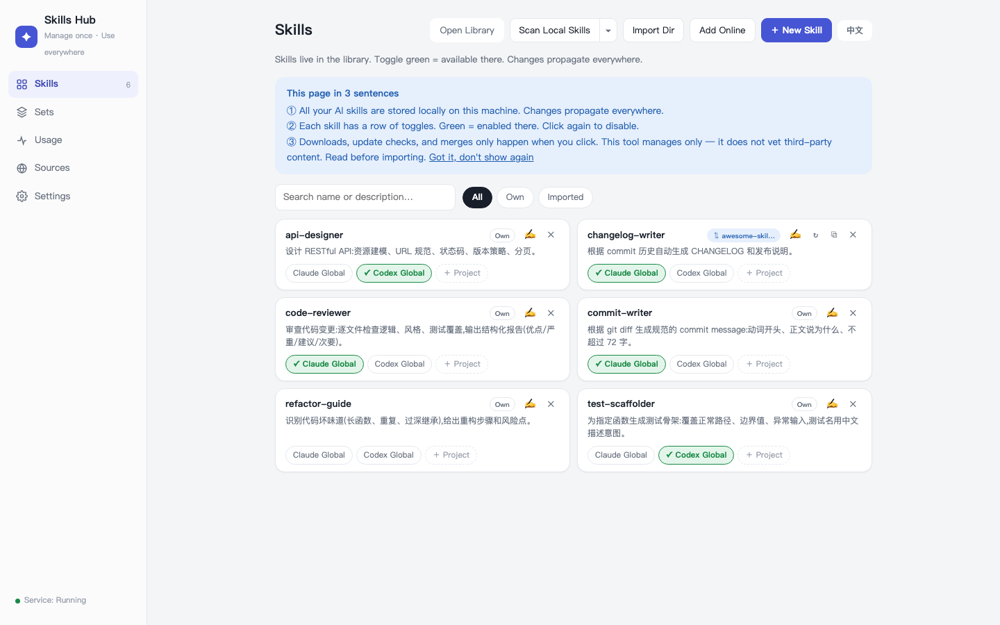

# Skills Hub

**One library for all your AI agent skills — manage, toggle, and update them from a single local web UI.**

[中文文档 →](README.zh-CN.md)



Skills Hub keeps every skill (a folder with a `SKILL.md`) in one local library and links it into wherever your agents look for skills — Claude Code (`~/.claude/skills`), Codex (`~/.codex/skills`), generic Agents (`~/.agents/skills`), or any project directory. Edit once, effective everywhere; delete a link, the skill stays safe in the library.

- **Single-file, no npm/pip install** - Python 3.9+ and Git are the only requirements. One file, one command.
- **Local-first** — a loopback-only HTTP server (`127.0.0.1:7799`). Nothing leaves your machine.
- **Cross-platform** — macOS / Linux (symlinks), Windows (symlink → junction → copy fallback).
- **Everything is undoable** — every change is committed to a local git history; deletes go to a trash folder, never `rm -rf`.
- **Bilingual UI** — auto-detects Chinese/English from your browser, switch anytime from the top-right corner.

## Quick start

```bash
git clone https://github.com/Liang-HZ/skills-hub.git
cd skills-hub
python3 webui.py          # opens http://127.0.0.1:7799
```

Windows: double-click `start-windows.bat` (or `py webui.py`).
Optional native desktop window: `pip install pywebview && python3 desktop.py`.

The UI needs three sentences to understand:

1. All your skills live in this machine's library — deleting a toggle never deletes the skill, edits apply everywhere.
2. Each skill has a row of toggles: green = usable there (Claude global / Codex global / a specific project).
3. Nothing touches the network unless you click a button that says so.

## What it does

| Tab | What you do there |
|-----|-------------------|
| Skills | Create, edit, import, adopt stray skills found on your machine (native directory picker or type a path); toggle where each one is enabled |
| Sets | Group skills you always use together; enable/disable a whole set in one click |
| Usage | See what's enabled where (global roots and every project), clean up dead projects |
| Sources | Clone third-party skill repos into an isolated `vendor/` area, cherry-pick skills as snapshots, and update them manually |
| Settings | Behavior options |

### The sovereignty model for third-party skills

Third-party repos are cloned into `vendor/<source>/` — an inert inbox that is **never live**. Importing a skill copies a snapshot of it into your library. Updating is two separate, explicit authorizations:

1. **Check** — only now does a `git fetch` happen. You see the new commits and exactly which files of which imported skills changed. The check issues a one-time, short-lived token bound to *that source at that commit*.
2. **Update** — consumes the token and fast-forwards to exactly the commit you reviewed. It cannot re-resolve "latest" behind your back.

All git commands the manager runs use an isolated empty `core.hooksPath`, so no repository or global git hook can turn a management action into code execution.

### What it deliberately does NOT do

Skills Hub is a manager, not a security scanner:

- It does **not** judge whether a skill is safe, and never runs a skill's own scripts, installers, or examples.
- It does **not** auto-download anything — sources, updates, dependencies, models. Every network action is behind an explicit button labeled as such.
- It shows you diffs and provenance so *you* can decide. **Read third-party skills before enabling them.**

Write APIs are protected server-side (loopback host + same-origin + JSON content-type + per-session CSRF token), so a malicious web page can't drive your manager.

## Data layout

```
library/               your skills (the single source of truth)
library/.origins.json  provenance of each skill (own / tracking upstream / detached copy)
sets/                  skill groups, one name per line
vendor/                isolated clones of third-party repos (never live)
targets.txt            registry of project dirs that use skills
attic/trash/           where "deleted" skills actually go
```

Your skills and sets are auto-committed to the local git history (only `library/` and `sets/`), which is your undo path. To keep your data outside the code checkout, set `SKILLS_HUB_ROOT=/path/to/data` — the app will initialize a separate data repo there and `git pull` upgrades stay trivial.

## Run it at login

See [docs/autostart.md](docs/autostart.md) for launchd (macOS), systemd (Linux), and Task Scheduler (Windows) recipes.

## CLI (macOS/Linux)

`skillctl` is a bash equivalent of the toggles: `skillctl list | sets | status | enable <target> <skill|@set> | disable | add | new`.

## Tests

```bash
python3 -m unittest discover -s tests
```

The regression suite pins the product boundary: no code execution paths, no network without an explicit click, token-gated updates, CSRF enforcement.

## License

[MIT](LICENSE)
