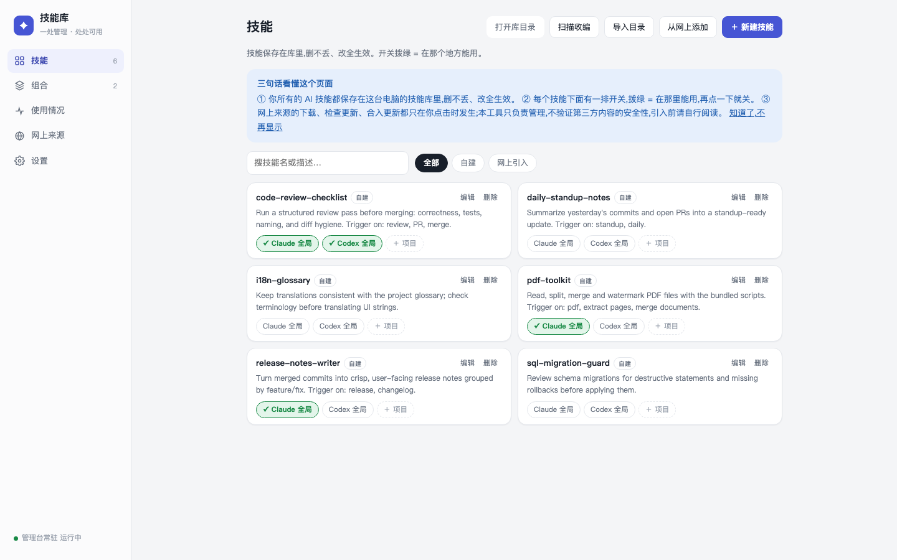

# Skills Hub · 技能库

**一处管理所有 AI agent 技能——本地网页统一开关、组合、更新。**

[English →](README.md)



所有技能(带 `SKILL.md` 的文件夹)的唯一真源放在本机的 `library/`,再链接到各个 agent 找技能的地方——Claude Code(`~/.claude/skills`)、Codex(`~/.codex/skills`)、通用 Agents(`~/.agents/skills`)或任意项目目录。改一处、处处生效;关掉开关只是摘链接,技能永远安全地留在库里。

- **单文件,无需 npm/pip 安装**--只需 Python 3.9+ 和 Git。一个文件,一条命令。未安装 Git 时会显示安装引导。
- **纯本地**——只监听 `127.0.0.1:7799`,任何数据不出机器。
- **跨平台**——macOS / Linux 用软链接;Windows 依次尝试 symlink → junction → 副本。
- **步步可回退**——每次变更自动进本地 git 历史;删除只进回收站,从不真删。

## 快速开始

```bash
git clone https://github.com/Liang-HZ/skills-hub.git
cd skills-hub
python3 webui.py          # 自动打开 http://127.0.0.1:7799
```

Windows:双击 `start-windows.bat`(或 `py webui.py`)。
可选桌面窗口:`pip install pywebview && python3 desktop.py`。

页面三句话就能看懂:

1. 所有技能都保存在这台电脑的技能库里,删不丢、改全生效。
2. 每个技能下面一排开关,拨绿 = 在那里能用(Claude 全局 / Codex 全局 / 某个项目)。
3. 不点带"联网"字样的按钮,它绝不碰网络。

## 功能

| 标签页 | 用来做什么 |
|-------|-----------|
| 技能 | 新建、编辑、导入、收编本机散装技能;控制每个技能在哪里启用 |
| 组合 | 把常一起用的技能存成一组,一键整组开关 |
| 使用情况 | 每个地方(全局/各项目)各自开了什么,一键清理失效项目 |
| 网上来源 | 把第三方技能仓库克隆进隔离区,挑着引入快照,手动跟进更新 |
| 设置 | 行为选项 |

### 第三方技能的主权模型

第三方仓库克隆到 `vendor/<源>/`——一个**永不直接生效**的惰性收件箱。引入 = 把当时的内容复制成快照进库。更新是**两次独立授权**:

1. **检查**——此时才 `git fetch`。页面列出新提交、哪些已引入技能的哪些文件变了,并签发一枚绑定"该来源 + 该目标提交"的一次性短期令牌。
2. **更新**——消费令牌,只快进到你刚看过的那个提交,不会背着你重新解析"最新版"。

管理器发起的所有 git 命令都使用独立空 `core.hooksPath`,任何仓库或全局 git hook 都无法把管理动作变成代码执行。

### 它刻意不做什么

Skills Hub 是管理器,不是安全扫描器:

- **不判断**技能是否安全,永不执行技能自带的脚本、安装器、示例。
- **不自动下载**任何东西——来源、更新、依赖、模型都不会。所有联网动作都在明确标注"联网"的按钮后面。
- 它把差异和来历摆给你看,决定权在你。**第三方技能启用前请自行阅读。**

写 API 在后端强制校验(loopback Host + 同源 + JSON Content-Type + 会话 CSRF 令牌),恶意网页无法驱动你的管理器。

## 数据布局

```
library/               你的技能(唯一真源)
library/.origins.json  每个技能的来历(自建/跟随更新/独立副本)
sets/                  组合,一行一个技能名
vendor/                第三方仓库隔离区(永不直接生效)
targets.txt            用过技能的项目目录注册表
attic/trash/           "删除"实际去的地方
```

技能与组合的每次变更自动提交进本地 git(只提交 `library/` 和 `sets/`),这就是你的撤销路径。想把数据放在代码目录之外:设置 `SKILLS_HUB_ROOT=/你的数据目录`,应用会在那里单独初始化数据仓库,升级时 `git pull` 毫无纠缠。

## 开机自启

macOS(launchd)、Linux(systemd)、Windows(任务计划程序)配置见 [docs/autostart.md](docs/autostart.md)。

## 命令行(macOS/Linux)

`skillctl` 是开关的 bash 等价物:`skillctl list | sets | status | enable <目标> <技能|@组合> | disable | add | new`。

## 测试

```bash
python3 -m unittest discover -s tests
```

回归测试钉死产品边界:无代码执行路径、点击之外无网络、令牌门禁的更新、CSRF 强制校验。

## 许可

[MIT](LICENSE)
